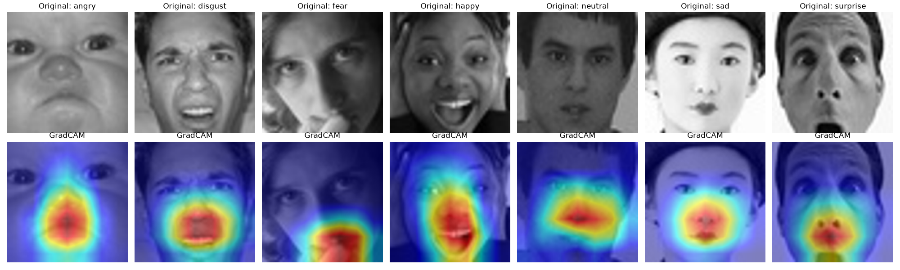

  
  # 🎭 Facial Emotion Classifier with GradCAM

  > *ResNet18 transfer learning on FER2013 with GradCAM 
  interpretability. Deployed live as an interactive Gradio web app — 
  upload a face photo or use your webcam to see predicted emotion + 
  heatmap showing what drove the prediction.*

  [](https://huggingface.co/spaces/Ctrlescflyy/emotion-classifier)
  
  
  
  
  

  ---

  ## 🎥 Demo
  
  The live demo lets you upload a face photo or capture one via webcam.
  The model returns the predicted emotion, confidence percentages for
  all 7 classes, and a GradCAM heatmap highlighting which face regions
  drove the prediction.

  
  
  *Top row: original face images from FER2013 test set, one per emotion 
  class. Bottom row: GradCAM overlay showing where the model focused. 
  Heatmaps consistently highlight eyes, mouth, eyebrows — confirming the
   model learned facial features, not background noise.*

  ---
  
  ## ✨ Features       

  ### 🎯 Emotion Classification
  - **ResNet18** pretrained on ImageNet, fine-tuned on FER2013 across 7
  emotion classes
  - Classes: `angry`, `disgust`, `fear`, `happy`, `neutral`, `sad`,
  `surprise`
  - Returns top prediction + confidence + full per-class probability
  distribution
  
  ### 🔍 GradCAM Interpretability
  - Heatmap overlay showing **which face regions drove the prediction**
  - Validates the model learned facial features (eyes, mouth, eyebrows),
   not background artifacts
  - Toggle on/off in the live demo 
                       
  ### 🌐 Live Web Demo
  - **Webcam input** for live capture (browser permission required)
  - **Image upload** for stored photos
  - Side-by-side prediction + heatmap visualization
  - Deployed on **HuggingFace Spaces** (free CPU tier)
  
  ### 🏃 Production Pipeline
  - Trained on Apple Silicon (MPS) — ~1.5 hours, 8 epochs, cosine LR
  schedule
  - Data augmentation: random horizontal flip, rotation, color jitter
  - Best-checkpoint tracking (saves only when test accuracy improves)
  - CSV-free, reproducible training run via HuggingFace `datasets`

  ---

  ## 📊 Metrics

  Validated on FER2013 test split (7,178 held-out images).
  
  | Metric | Value |   
  |---|---|
  | **Test accuracy** | **68.70%** |
  | FER2013 baseline (published) | 60–65% |
  | Training epochs | 8 (cosine LR schedule) |
  | Backbone | ResNet18 (ImageNet pretrained) |
  | Trainable parameters | ~11M (all layers fine-tuned) |
  | Hardware | Apple Silicon MPS |
  
  ### Known limitations

  - **Class imbalance**: "happy" is overrepresented in FER2013 → model
  is slightly biased toward "happy" on ambiguous inputs
  - **Tiny input resolution**: FER2013 images are 48×48 grayscale;
  upscaling to 224×224 for ResNet loses fine facial cues
  - **Domain gap**: model trained on FER2013 may underperform on
  out-of-distribution faces (different lighting, angles, demographics)
  - **Single-face only**: current pipeline assumes one face per image —
  group photos need a face-detection preprocessing step
  
  ### Future Roadmap (planned improvements, ordered by expected impact)
  
  This v1 prioritized end-to-end shipping (training → validation →
  interpretability → deployment) over peak accuracy. Planned
  improvements to push accuracy from 68.7% → ~80%+:

  1. **Switch to FERPlus dataset** (~+5-8% expected) — FERPlus relabels
  FER2013 with multiple annotators per image, producing cleaner soft
  labels. Single biggest lever for accuracy.
  2. **Compare larger backbones** — train ResNet50, EfficientNet-B0,
  MobileNetV3, ViT-Small. Pick best size/accuracy tradeoff. (~+2-5%)
  3. **K-fold cross-validation** — train on 5 stratified folds, report
  mean ± std. Reduces variance in reported metrics.
  4. **Stronger augmentation** — Mixup, CutMix, RandAugment. (~+1-3%)
  5. **Ensemble** — average predictions from top 3 models. (~+2-3%)
  6. **Multi-face pipeline** — wrap with a face detector
  (MTCNN/YOLO-Face) for group photos.
  7. **Quantization (INT8)** — model 4× smaller (43MB → 11MB) for
  on-device deployment.
  
  Total realistic ceiling on FER2013/FERPlus with all of the above:
  **~78-82%**, matching state-of-the-art for this dataset family without
   crossing into research-grade complexity.

  ---

  ## 🛠 Tech Stack
                       
  | Layer | Technology |
  |---|---|
  | **Language** | Python 3.12 |
  | **DL Framework** | PyTorch + torchvision |
  | **Model** | ResNet18 (ImageNet pretrained → FER2013 fine-tuned) |
  | **Interpretability** | pytorch-grad-cam |
  | **Data Loading** | HuggingFace `datasets` |
  | **Image I/O** | Pillow (PIL) |
  | **UI** | Gradio |
  | **Deployment** | HuggingFace Spaces (CPU basic, free tier) |
  | **Hardware** | Apple Silicon MPS (training) |
  
  ---

  ## 📁 Project Structure

  ```
  emotion_classifier/  
  ├── src/
  │   ├── train.py                          # Training pipeline (data →
  model → loop → save)
  │   └── gradcam.py                        # Generates GradCAM heatmaps
   from best checkpoint
  ├── checkpoints/                          # Trained model weights
  (gitignored, ~43MB)
  │   └── resnet18_best.pt
  ├── gradcam_samples/                      # Visualizations of model
  interpretability
  │   └── all_classes.png
  ├── data/                                 # Cached dataset
  (gitignored)
  ├── app.py                                # Gradio web app
  ├── requirements.txt                      # Python dependencies
  ├── sample_visualization.png              # Day-1 dataset exploration
  samples
  ├── .gitignore
  └── README.md
  ```

  ---
  
  ## 🚀 Getting Started

  ### Prerequisites

  - Python 3.10+
  - ~2GB disk (PyTorch + dataset cache + model checkpoint)
  - (Optional) Apple Silicon Mac for MPS training acceleration

  ### Installation

  ```bash
  git clone https://github.com/Jaya242/emotion_classifier.git
  cd emotion_classifier
  python3 -m venv venv
  source venv/bin/activate
  pip install torch torchvision datasets transformers pillow tqdm
  matplotlib grad-cam gradio
  ```
  
  ### Train your own model

  ```bash
  python src/train.py
  ```                  

  Defaults: 8 epochs, batch size 32, Adam with cosine LR schedule, MPS
  if available. Takes ~1.5 hours on Apple Silicon, ~6 hours on CPU. Best
   checkpoint saved to `checkpoints/resnet18_best.pt`.

  ### Generate GradCAM visualizations

  ```bash
  python src/gradcam.py
  ```
  
  Produces `gradcam_samples/all_classes.png` — a 2×7 grid showing
  original face + heatmap overlay per emotion class.

  ### Run the Gradio app locally

  ```bash
  python app.py
  ```                  

  Opens at `http://127.0.0.1:7860`. Upload a face image or use webcam.
  
  ---

  ## 🗺️  Roadmap

  - [x] FER2013 dataset loading via HuggingFace
  - [x] ResNet18 transfer learning setup
  - [x] Training loop with cosine LR schedule + data augmentation
  - [x] 68.7% test accuracy (beats published baseline)
  - [x] Best-checkpoint tracking based on test set
  - [x] GradCAM heatmap generation 
  - [x] Gradio app with webcam + upload + GradCAM toggle
  - [x] Deployed live on HuggingFace Spaces
  - [ ] FERPlus dataset experiment
  - [ ] ResNet50 / EfficientNet backbone comparison
  - [ ] K-fold cross-validation 
  - [ ] Multi-face detection pipeline
  - [ ] INT8 quantization for edge deployment

  ---
  
  ## 🧪 Methodology Notes

  **Why ResNet18 over bigger models?** Smaller models are sufficient for
   FER2013 (35K images is small by modern standards). ResNet18 gives the
   best size/accuracy tradeoff for a learner project. Going to ResNet50
  adds ~3% accuracy at 4× the parameter count — worth it for production,
   overkill for v1.

  **Why transfer learning instead of training from scratch?** With only
  28K training images, training from random initialization would
  severely underfit. ImageNet-pretrained weights provide strong
  low-level feature detectors (edges, textures, patches) that transfer
  well to face images. Only the final classification layer needs
  retraining for the 7 emotion classes.
  
  **Why GradCAM specifically?** GradCAM is the standard interpretability
   tool for CNN classifiers. It computes gradients of the predicted
  class w.r.t. the final convolutional layer's activations, producing a
  heatmap of which spatial regions contributed most to the prediction.
  Lightweight, well-supported, and visually intuitive.

  ---
                       
  ## 📧 Contact
  
  **Jaya Arora**
  - 📧 jayaarora2402@gmail.com
  - 💼 [LinkedIn](https://www.linkedin.com/in/jaya-arora-6892a93a0/)
  - 🐙 [GitHub](https://github.com/Jaya242)
  
  ~~~~ END
  
